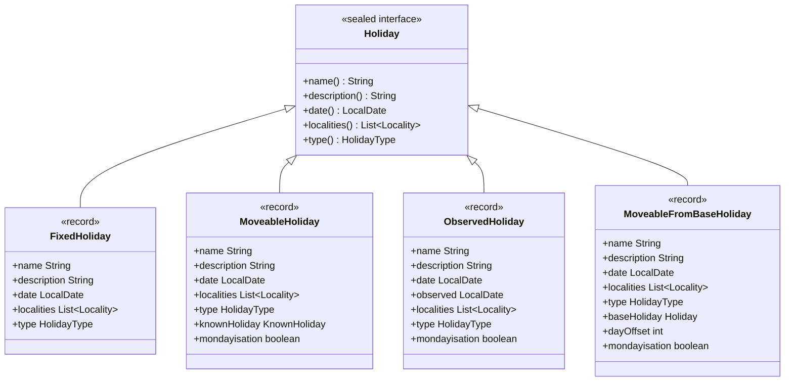
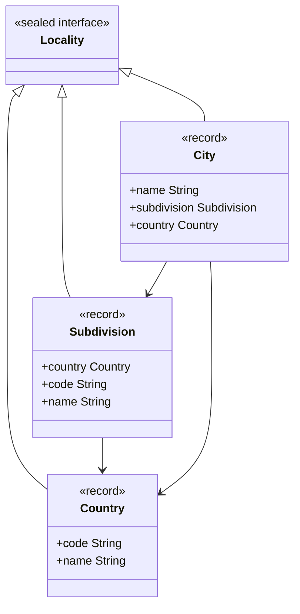
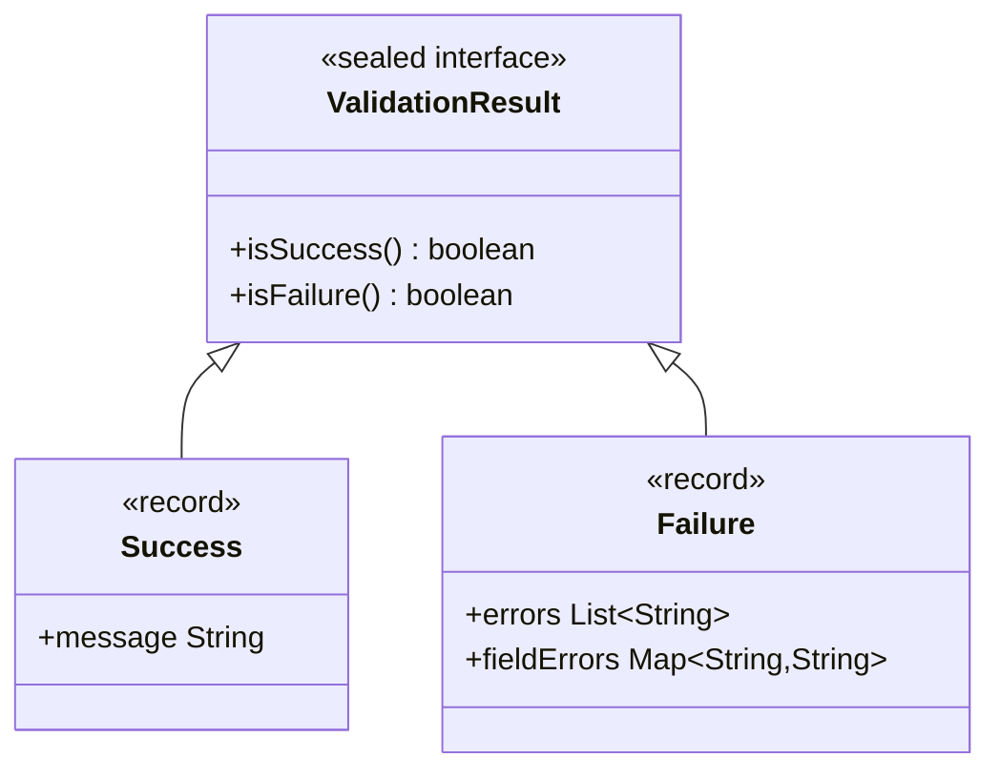

# Design Document

## Overview

This document outlines the design for a comprehensive REST API that demonstrates Data-Oriented Programming (DOP) principles using Java 24, Spring Boot 3.5.4, and MongoDB 8. The system will manage public holidays across different geographical locations with support for various holiday types including fixed dates, moveable holidays, and observed holidays with mondayisation rules.

The design builds upon the existing DOP domain model in the `me.clementino.holiday.domain.dop` package and extends it to create a complete, production-ready API that serves as both a functional system and an educational example of DOP principles.

## Architecture

### High-Level Architecture

The system follows a layered architecture with clear separation of concerns:

```
┌─────────────────────────────────────────────────────────────┐
│                    Presentation Layer                        │
│  ┌─────────────────┐  ┌─────────────────┐  ┌──────────────┐ │
│  │ REST Controllers │  │   Swagger UI    │  │ Error Handler│ │
│  └─────────────────┘  └─────────────────┘  └──────────────┘ │
└─────────────────────────────────────────────────────────────┘
                                │
┌─────────────────────────────────────────────────────────────┐
│                    Application Layer                         │
│  ┌─────────────────┐  ┌─────────────────┐  ┌──────────────┐ │
│  │   DTOs/Records  │  │   MapStruct     │  │  Validation  │ │
│  │                 │  │   Mappers       │  │   Records    │ │
│  └─────────────────┘  └─────────────────┘  └──────────────┘ │
└─────────────────────────────────────────────────────────────┘
                                │
┌─────────────────────────────────────────────────────────────┐
│                     Service Layer                            │
│  ┌─────────────────┐  ┌─────────────────┐  ┌──────────────┐ │
│  │ Holiday Service │  │ Year Calculator │  │ Cache Service│ │
│  │                 │  │    Service      │  │              │ │
│  └─────────────────┘  └─────────────────┘  └──────────────┘ │
└─────────────────────────────────────────────────────────────┘
                                │
┌─────────────────────────────────────────────────────────────┐
│                     Domain Layer (DOP)                      │
│  ┌─────────────────┐  ┌─────────────────┐  ┌──────────────┐ │
│  │ Holiday (Sealed │  │ Locality (Sealed│  │   Holiday    │ │
│  │   Interface)    │  │   Interface)    │  │  Operations  │ │
│  └─────────────────┘  └─────────────────┘  └──────────────┘ │
└─────────────────────────────────────────────────────────────┘
                                │
┌─────────────────────────────────────────────────────────────┐
│                   Persistence Layer                          │
│  ┌─────────────────┐  ┌─────────────────┐  ┌──────────────┐ │
│  │ JPA Entities    │  │ Spring Data     │  │   MongoDB    │ │
│  │                 │  │   Repositories  │  │   Config     │ │
│  └─────────────────┘  └─────────────────┘  └──────────────┘ │
└─────────────────────────────────────────────────────────────┘
```

### DOP Principles Implementation

1. **Model Data Immutably and Transparently**: All domain objects use Java 24 records
2. **Model the Data, the Whole Data, and Nothing but the Data**: Each record contains exactly what it needs
3. **Make Illegal States Unrepresentable**: Sealed interfaces prevent invalid holiday types and localities
4. **Separate Operations from Data**: All business logic in dedicated operation classes

## Components and Interfaces

### Core Domain Components

#### Holiday Sealed Interface Hierarchy

```java
public sealed interface Holiday 
    permits FixedHoliday, ObservedHoliday, MoveableHoliday, MoveableFromBaseHoliday {
    // Common interface methods for all holiday types
    String name();
    String description();
    LocalDate date();
    List<Locality> localities();
    HolidayType type();
}
```

#### Locality Sealed Interface Hierarchy

```java
public sealed interface Locality 
    permits Locality.Country, Locality.Subdivision, Locality.City {
    
    record Country(String code, String name) implements Locality {}
    record Subdivision(Country country, String code, String name) implements Locality {}
    record City(String name, Subdivision subdivision, Country country) implements Locality {}
}
```

#### Holiday Operations (Pure Functions)

```java
public final class HolidayOperations {
    // Pure functions for holiday calculations
    public static Holiday calculateDate(Holiday holiday, int year);
    public static Holiday calculateObservedDate(Holiday holiday, int year);
    public static List<Holiday> filterByLocality(List<Holiday> holidays, Locality locality);
    public static ValidationResult validateHoliday(Holiday holiday);
}
```

### Application Layer Components

#### Request/Response DTOs (Records)

```java
public record CreateHolidayRequest(
    String name,
    String description,
    HolidayTypeDto type,
    LocalityDto locality,
    HolidayVariantDto variant
) {}

public record HolidayResponse(
    String id,
    String name,
    String description,
    LocalDate date,
    LocalDate observedDate,
    HolidayTypeDto type,
    LocalityDto locality,
    HolidayVariantDto variant,
    OffsetDateTime createdAt,
    OffsetDateTime updatedAt
) {}
```

#### Query Objects (Records)

```java
public record HolidayQuery(
    Optional<String> countryCode,
    Optional<String> subdivisionCode,
    Optional<String> cityName,
    Optional<HolidayType> type,
    Optional<LocalDate> startDate,
    Optional<LocalDate> endDate,
    Optional<Integer> year,
    Optional<Boolean> includeObserved
) {}
```

#### Command Objects (Records)

```java
public sealed interface HolidayCommand {
    record Create(Holiday holiday) implements HolidayCommand {}
    record Update(String id, Holiday holiday) implements HolidayCommand {}
    record Delete(String id) implements HolidayCommand {}
    record CalculateForYear(String holidayId, int year) implements HolidayCommand {}
}
```

### Service Layer Components

#### HolidayService

- Orchestrates holiday operations
- Handles persistence concerns
- Delegates pure operations to HolidayOperations
- Manages year-based holiday calculations

#### YearCalculatorService

- Calculates holidays for specific years
- Caches calculated holidays in database
- Uses HolidayOperations for pure calculations

#### ValidationService

- Validates holiday data using sealed interfaces
- Returns ValidationResult sealed interface

### Persistence Layer Components

#### Holiday Entity (JPA)

```java
@Document(collection = "holidays")
public class HolidayEntity {
    @Id private String id;
    private String name;
    private String description;
    private LocalDate date;
    private LocalDate observedDate;
    private String holidayType; // Serialized holiday variant
    private String localityType; // Serialized locality
    private OffsetDateTime createdAt;
    private OffsetDateTime updatedAt;
    private Integer year; // For calculated instances
    private String baseHolidayId; // For derived holidays
}
```

## Data Models

### Holiday Type Hierarchy



### Locality Hierarchy



### Validation Result Model



## Error Handling

### Error Response Model

```java
public record ErrorResponse(
    String error,
    String message,
    List<String> details,
    String path,
    OffsetDateTime timestamp,
    int status
) {}
```

### Exception Hierarchy

```java
public sealed interface HolidayException {
    record NotFound(String id, String message) implements HolidayException {}
    record ValidationFailed(List<String> errors) implements HolidayException {}
    record CalculationFailed(String holidayId, int year, String reason) implements HolidayException {}
    record PersistenceFailed(String operation, String reason) implements HolidayException {}
}
```

### Global Exception Handler

- Maps domain exceptions to appropriate HTTP status codes
- Uses sealed interfaces for type-safe exception handling
- Returns consistent error response format

## Testing Strategy

### Unit Tests

- **Domain Operations**: Test all pure functions in HolidayOperations
- **Validation Logic**: Test ValidationResult sealed interface variants
- **Holiday Calculations**: Test date calculations for all holiday types
- **Locality Matching**: Test hierarchical locality matching logic

### Integration Tests

- **Repository Layer**: Test MongoDB operations using Testcontainers
- **Service Layer**: Test service orchestration with mocked repositories
- **Mapper Layer**: Test MapStruct mappings between layers

### End-to-End Tests

- **API Endpoints**: Test complete request/response cycles
- **Holiday Calculations**: Test year-based holiday calculation and persistence
- **Error Scenarios**: Test error handling and validation
- **Query Operations**: Test complex filtering and searching

### Test Data Generation

- Use Instancio library for generating test data
- Create builders for complex holiday hierarchies
- Generate realistic locality data for different countries

### Test Configuration

```java
@TestConfiguration
public class TestConfig {
    @Bean
    @Primary
    public MongoTemplate testMongoTemplate() {
        // Testcontainers MongoDB configuration
    }
    
    @Bean
    public InstancioApi instancio() {
        // Instancio configuration for test data
    }
}
```

## API Design

### REST Endpoints

#### Holiday Management

- `GET /api/holidays` - List holidays with filtering
- `GET /api/holidays/{id}` - Get specific holiday
- `POST /api/holidays` - Create new holiday
- `PUT /api/holidays/{id}` - Update holiday
- `DELETE /api/holidays/{id}` - Delete holiday

#### Year-based Operations

- `GET /api/holidays/year/{year}` - Get all holidays for specific year
- `GET /api/holidays/{id}/year/{year}` - Get specific holiday for year
- `POST /api/holidays/{id}/calculate/{year}` - Calculate and persist holiday for year

#### Query Operations

- `GET /api/holidays/country/{countryCode}` - Holidays by country
- `GET /api/holidays/locality` - Holidays by locality (query params)
- `GET /api/holidays/type/{type}` - Holidays by type
- `GET /api/holidays/date-range` - Holidays in date range

### OpenAPI Documentation

- Comprehensive API documentation using SpringDoc
- Interactive Swagger UI for testing
- Request/response examples for all endpoints
- Schema documentation for all DTOs

## Implementation Considerations

### MapStruct Configuration

```java
@Mapper(componentModel = "spring")
public interface HolidayMapper {
    HolidayResponse toResponse(Holiday holiday);
    Holiday fromRequest(CreateHolidayRequest request);
    HolidayEntity toEntity(Holiday holiday);
    Holiday fromEntity(HolidayEntity entity);
}
```

### MongoDB Configuration

- Custom converters for sealed interfaces
- Proper indexing for query performance
- Connection pooling and timeout configuration

### Caching Strategy

- Cache calculated holidays by year
- Use Spring Cache abstraction
- Implement cache eviction policies

### Performance Considerations

- Lazy loading for complex holiday hierarchies
- Pagination for large result sets
- Database indexing for common queries
- Connection pooling for MongoDB

### Security Considerations

- Input validation using Bean Validation
- SQL injection prevention (NoSQL injection)
- Rate limiting for API endpoints
- Proper error message sanitization

This design provides a comprehensive foundation for implementing a DOP-based Holiday API that demonstrates modern Java features while maintaining clean architecture principles and high performance.
